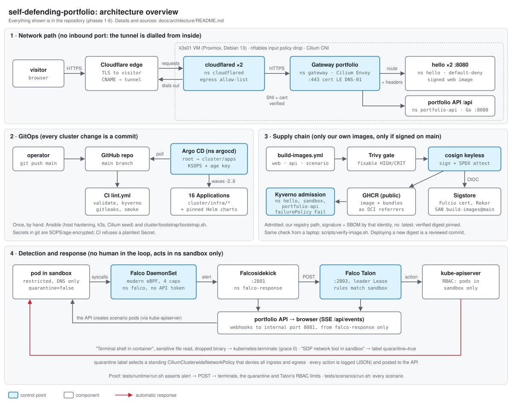

# Self-defending portfolio

A DevOps/security portfolio that is also the thing it describes: a single-node Kubernetes cluster
in a homelab that serves its own website, refuses software it did not build and sign, watches every
process it runs, and kills or isolates a compromised pod on its own. A visitor can press a button,
launch one of four controlled attacks (shell in a container, download tool, read of `/etc/shadow`,
drop-and-run a new binary) in a sandbox, and watch detection and response happen live, next to the
cluster's security posture.

**Live:** [hubertjablon.ski](https://hubertjablon.ski)
<!-- TODO-CONTENT: confirm what the live site serves today and update this line when the phase 5/6 demo goes live. -->

**Status:** phases 0-4 are built and running (hardened host, GitOps, public site behind a tunnel,
signed images enforced at admission, runtime detection and response, posture scanning). Phases 5-6
(the portfolio API, the four attack scenarios and the new site) are merged and awaiting acceptance on
the live cluster; they reach it in two steps, images first ([`docs/bootstrap.md`](docs/bootstrap.md)
§7). See [phases](#phases-and-definition-of-done) and [limitations](#limitations-and-not-done-yet).

---

## The 30-second tour

1. **Nothing listens on the internet.** The site reaches visitors through a Cloudflare Tunnel that the
   cluster dials *outbound*. The router and the host firewall have no open inbound port.
2. **The cluster is a git repository.** Apart from one bootstrap command, every object in the cluster
   is applied by Argo CD from this repo. Secrets are committed encrypted.
3. **Only signed software runs where it matters.** The site image is built, vulnerability-gated,
   given an SBOM and signed in GitHub Actions without any stored key. The cluster checks that
   signature at admission and rejects anything else.
4. **Running containers are watched.** Falco sees every process start in the cluster. A shell in a
   sandbox pod gets that pod deleted within seconds; a network tool gets it cut off from the network.
   No human in the loop.
5. **The attack button is fenced in.** A visitor can only pick one of four fixed scenarios, one run
   at a time, a few per visitor and hour; each runs as a hardened, signed, resource-capped pod in the
   sandbox, and the page streams Falco's alert and Talon's response as they happen.
6. **Every claim has a test.** Each control below links to the code that implements it and to the
   command that proves it.



## Key security controls

| Control | What it does | Code | Why (ADR) |
|---------|--------------|------|-----------|
| Outbound-only exposure | Cloudflare Tunnel, no port-forward, host firewall default-deny input | [`cluster/infra/cloudflared/`](cluster/infra/cloudflared/), [`nftables.conf.j2`](ansible/roles/firewall/templates/nftables.conf.j2) | [0003](docs/adr/0003-cloudflare-tunnel-exposure.md), [0009](docs/adr/0009-nftables-host-firewall.md) |
| TLS end to end | Let's Encrypt via DNS-01 on the Gateway; the tunnel verifies the origin certificate | [`cluster/infra/gateway/`](cluster/infra/gateway/), [`cluster/infra/cert-manager-issuers/`](cluster/infra/cert-manager-issuers/) | [0010](docs/adr/0010-cilium-gateway-api.md) |
| Security headers at the edge of the cluster | HSTS, strict CSP with Trusted Types (same policy in the image and at the route, checked in CI), nosniff, Referrer/Permissions policy, COOP | [`cluster/infra/hello/httproute.yaml`](cluster/infra/hello/httproute.yaml), [`app/web/security-headers.conf`](app/web/security-headers.conf) | [0010](docs/adr/0010-cilium-gateway-api.md), [0019](docs/adr/0019-frontend-stack-and-csp.md) |
| Default-deny networking | Per-namespace default-deny plus explicit Cilium allow-lists, FQDN-scoped egress | `cluster/infra/*/networkpolicy.yaml`, `ciliumnetworkpolicy.yaml` | [0004](docs/adr/0004-cilium-as-cni.md), [0014](docs/adr/0014-posture-scanning.md) |
| GitOps | Argo CD app-of-apps, pinned charts, self-heal | [`cluster/apps/`](cluster/apps/), [`cluster/bootstrap/`](cluster/bootstrap/) | [0005](docs/adr/0005-argocd-for-gitops.md), [0008](docs/adr/0008-pinned-versions.md) |
| Secrets in a public repo | SOPS + age, decrypted only inside Argo CD; CI rejects plaintext Secrets | [`.sops.yaml`](.sops.yaml), [`scripts/check-secrets-encrypted.sh`](scripts/check-secrets-encrypted.sh) | [0006](docs/adr/0006-sops-age-for-secrets.md) |
| Signed, scanned, described images | One matrix workflow for every image (site, API, scenario target): Trivy gate, SPDX SBOM attestation, cosign keyless signing bound to that workflow on `main` | [`.github/workflows/build-images.yml`](.github/workflows/build-images.yml) | [0011](docs/adr/0011-supply-chain.md), [0016](docs/adr/0016-one-image-workflow.md) |
| Admission control | Kyverno: signature + SBOM required, own registry only, no `:latest`, Pod Security `restricted`, resource limits | [`cluster/infra/kyverno-policies/`](cluster/infra/kyverno-policies/) | [0011](docs/adr/0011-supply-chain.md), [0012](docs/adr/0012-pod-security-and-resource-policy.md) |
| Runtime detection and response | Falco (eBPF, 4 capabilities, read-only host mounts, no API token) → Falcosidekick → Falco Talon (kill / quarantine, `sandbox` only) | [`cluster/infra/falco/`](cluster/infra/falco/), [`cluster/infra/falco-response/`](cluster/infra/falco-response/), [`cluster/infra/sandbox/`](cluster/infra/sandbox/) | [0013](docs/adr/0013-runtime-detection-and-response.md) |
| A visitor-triggered attack that stays controlled | Four fixed scenarios as restricted, signed, quota-bound pods in `sandbox`; the API is rate-limited, same-origin only, holds RBAC for `sandbox` pods and report reads only, and its webhook port admits Falcosidekick and Talon alone | [`app/api/`](app/api/), [`cluster/infra/portfolio-api/`](cluster/infra/portfolio-api/), [`cluster/infra/sandbox/scenarios/`](cluster/infra/sandbox/scenarios/scenarios.yaml) | [0015](docs/adr/0015-portfolio-api.md), [0017](docs/adr/0017-attack-scenario-safety-model.md), [0018](docs/adr/0018-scenario-detection-and-response-mapping.md) |
| Posture scanning | Trivy Operator (images, config, RBAC, secrets), daily CIS benchmark (kube-bench), Policy Reporter | [`cluster/apps/trivy-operator.yaml`](cluster/apps/trivy-operator.yaml), [`cluster/infra/kube-bench/`](cluster/infra/kube-bench/) | [0014](docs/adr/0014-posture-scanning.md) |
| Host hardening | SSH key-only from admin VLANs, sysctl, auditd, unattended upgrades, k3s audit log and secrets encryption | [`ansible/roles/`](ansible/roles/) | [0001](docs/adr/0001-dedicated-vm-for-the-cluster.md), [0007](docs/adr/0007-cloud-init-and-ansible-bootstrap.md) |

The threat model ([`docs/threat-model.md`](docs/threat-model.md)) lists what these controls do
*not* cover.

<!-- TODO-CONTENT: optional short "about me" paragraph (role, what I am looking for, contact link). Only facts you want public. -->

---

## For engineers

### Architecture

Detailed diagrams, one per flow, each with a table of the files behind every arrow:
[`docs/architecture/`](docs/architecture/README.md).

```
visitor ─HTTPS─> Cloudflare edge <─tunnel, dialled outbound─ cloudflared x2 (ns cloudflared)
                                                                  │ HTTPS :443, SNI + cert verified
                                         Cilium Gateway API (Envoy), Gateway "portfolio" (ns gateway)
                                     HTTPRoute / + headers │                 │ HTTPRoute /api
                                 hello x2, signed web image :8080      portfolio-api :8080 (ns portfolio-api)
                                                                         │ pods + exec via the API server
                                                                       scenario pods (ns sandbox)

k3s01: Proxmox VM, Debian 13, hardened by Ansible
├─ k3s v1.35 (no flannel, no kube-proxy, audit policy, secrets encryption)
├─ Cilium 1.19 (CNI, kube-proxy replacement, NetworkPolicy, Hubble, Gateway API)
├─ Argo CD v3.5 + KSOPS ── everything below is synced from git
├─ cert-manager ── Let's Encrypt DNS-01 certificate for the Gateway
├─ Kyverno ── 5 ClusterPolicies: signature + SBOM, registry allow-list, no :latest, PSS restricted, resources
├─ Trivy Operator + PolicyReport adapter, kube-bench CronJob, Policy Reporter (cluster-internal)
├─ Falco (modern eBPF) ──> Falcosidekick ──> Falco Talon ──> delete / label pods in ns sandbox
│                               └── alerts ──> portfolio-API :8081 <── actions ──┘   (live feed, SSE)
├─ sandbox: restricted, default-deny (DNS only), quarantine policy, quota, Talon's only RBAC
└─ portfolio-api: Go API, scenario catalogue, posture summary (Kyverno, Trivy, kube-bench reports)
```

The attack button: a Go API in its own namespace behind `/api` (ADR 0015) runs one of four fixed
scenarios as a pod in `sandbox` and streams Falco's and Talon's events to the browser (SSE). Limits:
3 attacks per 10 minutes per visitor, 30 per hour in total, one at a time, pods end after at most
120 s, and the sandbox quota caps everything at 3 pods, half a CPU and 512 MiB. Each scenario is
mapped to a Falco rule and a Talon response (ADR 0017, ADR 0018):

| Scenario | Technique | Detected by | Response |
|----------|-----------|-------------|----------|
| `shell-in-container` | T1059.004 | Terminal shell in container | pod deleted |
| `network-tool` | T1071.001 | SDP network tool in sandbox | pod quarantined |
| `sensitive-file-read` | T1003.008 | Read sensitive file untrusted | pod deleted |
| `drop-and-execute` | T1105 | Drop and execute new binary in container | pod deleted |

The site ([`app/web/`](app/web/), ADR 0019) is vanilla TypeScript bundled by esbuild: no framework,
no third-party origin, a CSP that allows only its own files and enforces Trusted Types, and a mock
mode (`?mock=1`) that follows the API contract without a cluster.

### Repository map

| Path | Purpose |
|------|---------|
| [`ansible/`](ansible/) | host hardening (base, SSH, nftables, sysctl, auditd, unattended upgrades) and the k3s + Cilium seed install |
| [`scripts/pve-create-vm.sh`](scripts/pve-create-vm.sh) | creates the VM on Proxmox from the Debian cloud image (API token from the environment) |
| [`cluster/bootstrap/`](cluster/bootstrap/) | the one manual step: Argo CD + KSOPS + the app-of-apps root |
| [`cluster/apps/`](cluster/apps/) | one Argo CD `Application` per component, ordered by sync wave |
| [`cluster/infra/`](cluster/infra/) | what those Applications deploy: namespaces, policies, network policies, workloads |
| [`app/web/`](app/web/) | the site: TypeScript + esbuild, unit and Playwright tests, two-stage image on nginx-unprivileged |
| [`app/api/`](app/api/) | the portfolio API (Go, distroless): scenarios, attack runs, SSE feed, posture |
| [`app/scenario/`](app/scenario/) | the busybox-only target image the attack scenarios run in |
| [`.github/workflows/`](.github/workflows/) | `lint.yml` (lint, validate, gitleaks, smoke) and `build-images.yml` (every `app/<name>`: test, build, scan, SBOM, sign) |
| [`scripts/`](scripts/) | validation and verification helpers used by `make` and CI |
| [`tests/`](tests/) | host idempotency smoke test, admission tests, runtime detection/response test, scenario tests, API abuse tests |
| [`docs/bootstrap.md`](docs/bootstrap.md) | zero-to-cluster-to-GitOps runbook, phase by phase |
| [`docs/adr/`](docs/adr/README.md) | architecture decision records: why, not just what |
| [`docs/architecture/`](docs/architecture/README.md) | diagrams |
| [`docs/threat-model.md`](docs/threat-model.md) | STRIDE per trust boundary, abuse cases, known gaps |

### Reproduce from zero

The full runbook, with the prerequisites (Proxmox API token, Cloudflare token and tunnel, age key)
and troubleshooting tables, is [`docs/bootstrap.md`](docs/bootstrap.md). The short version:

```sh
make lint          # yamllint, ansible-lint, shellcheck, playbook syntax (in a container)
make validate      # render cluster/, validate against Kubernetes + CRD schemas, run the Kyverno policies over it
make smoke         # hardening playbook twice in a throwaway container; second run must be changed=0

make vm            # Proxmox VM from the Debian 13 cloud image (needs PVE_HOST, PVE_TOKEN_ID, PVE_TOKEN)
make hardening     # phase 1; run twice, the second run must report changed=0
make cluster       # k3s (no flannel, no kube-proxy) + Cilium
make bootstrap     # installs Argo CD once (needs KUBECONFIG and SOPS_AGE_KEY_FILE); from here on, git push
```

The deployment-specific values (GitHub owner, hostname, ACME contact, tunnel UUID, age recipient,
the two encrypted secrets) are committed for this cluster; a fork replaces them first. Where each one
lives: [`cluster/bootstrap/README.md`](cluster/bootstrap/README.md) and
[`docs/bootstrap.md`](docs/bootstrap.md) §4.0.

<!-- TODO-CONTENT: measured time for a full rebuild from zero (docs/bootstrap.md, "Rebuild from zero"). -->

### Verify each claim yourself

| Claim | How to check | Needs |
|-------|--------------|-------|
| Each image (web, api, scenario) was signed by this repo's workflow on `main` and has an SPDX SBOM attestation | `scripts/verify-image.sh ghcr.io/hubertmj/self-defending-portfolio/<name>@sha256:<digest>` with the digest pinned under `cluster/` ([script](scripts/verify-image.sh)) | docker or cosign; no cluster |
| Manifests are valid, every chart renders, and the cluster's own policies pass over everything | `make validate` ([`scripts/validate-cluster.sh`](scripts/validate-cluster.sh)) | docker, python3, network |
| No plaintext Secret is committed; no secret in history | `scripts/check-secrets-encrypted.sh`, `make gitleaks` | docker |
| Host hardening is idempotent | `make smoke` ([`tests/smoke.sh`](tests/smoke.sh)) | docker |
| An unsigned image, a foreign registry and a `:latest` tag are all rejected at admission | `tests/admission/run.sh` ([script](tests/admission/run.sh)); with `SIGNED_IMAGE=...@sha256:...` it also proves a signed digest is admitted | cluster credentials |
| A shell in a sandbox pod raises a Falco alert and Talon deletes the pod; a network tool gets the pod quarantined; Talon cannot act outside `sandbox` | `make runtime-test` ([`tests/runtime/run.sh`](tests/runtime/run.sh)) | cluster credentials, `script` (util-linux) |
| Every scenario's Falco rule loads, its Talon rule matches, and its preconditions hold under the pod's own security context | `make scenario-offline` ([`tests/scenarios/offline.sh`](tests/scenarios/offline.sh)) | docker |
| Each of the four scenarios ends in the promised alert, action and end state | `make scenario-test` ([`tests/scenarios/run.sh`](tests/scenarios/run.sh)) | cluster credentials, `script` |
| The API refuses unknown scenarios, cross-site POSTs, bursts, a fourth attack and a fifth event stream | `make abuse-test` ([`tests/abuse/run.sh`](tests/abuse/run.sh)); the Go tests cover the same limits with `-race` (`cd app/api && go test -race ./...`) | the live site, or a port-forward |
| The site's CSP at the route is exactly the image's, and no placeholder digest is committed | `scripts/check-web-csp.sh`, `scripts/check-image-digests.sh` (both part of `make validate`) | python3 |
| Security headers and HTTPS redirect are served | `curl -sI https://hubertjablon.ski`, `curl -sI http://hubertjablon.ski` | nothing |
| Talon's permissions are limited to `sandbox` | `kubectl auth can-i delete pods -n hello --as=system:serviceaccount:falco-response:falco-talon` → `no` | cluster credentials |

They run locally before every push to main; CI runs the first four on pull requests and on demand ([`.github/workflows/lint.yml`](.github/workflows/lint.yml)).

### Phases and Definition of Done

| # | Phase | Definition of Done | State |
|---|-------|--------------------|-------|
| 0 | Reconnaissance | report, decisions, plan (ADR 0001-0009) | done |
| 1 | Repo + Ansible | second playbook run = 0 changes | done |
| 2 | Cluster + GitOps | the page over HTTPS, deployed only by `git push` | done |
| 3 | Supply chain | an unsigned image fails admission | done |
| 4 | Policies + runtime | a manual shell in a test pod = alert + kill | done |
| 5 | Demo app | four scenarios end to end, abuse test documented | merged, awaiting deployment and acceptance |
| 6 | Site + docs | a stranger understands the project in two minutes | merged, awaiting deployment and acceptance |
| 7 | Optional | Event-Driven Ansible, Hubble UI read-only, timed rebuild from zero | not started |

<!-- TODO-CONTENT: confirm the "done" states for phases 1-3 against the live cluster before publishing. -->

### Limitations and not done yet

Honest list; details and the rest are in the [threat model](docs/threat-model.md#7-known-gaps-and-residual-risk)
and the [ADR open items](docs/adr/README.md#open-items-carried-by-accepted-adrs).

- **Single node, single replica.** A node incident is a full outage; there is no HA and no described
  backup beyond "rebuild from git plus the age key".
- **The API keeps its state in memory.** Rate-limit windows, the 24 h counters and the event replay
  reset on a restart, and it runs as one replica by design (ADR 0015).
- **The attacks are behaviours, not exploits.** The scenarios show what Falco and Talon do about a
  shell, a download tool, a credential read and a dropped binary; they do not demonstrate an escape.
- **Two Kyverno policies fail open.** Pod Security `restricted` and required resources are Enforce,
  but with `failurePolicy: Ignore`, so a Kyverno outage admits pods unjudged (ADR 0012).
- **Kyverno `ClusterPolicy` is deprecated** in 1.19; migration to the new policy types is deferred.
- **Talon records its actions only in its own log** (and on the live feed): its Kubernetes Events
  notifier is broken in the pinned release (ADR 0013).
- **Argo CD runs without resource limits** and is excluded from the resources policy (recorded debt).
- **Some namespaces have no network policy** (`kyverno`, `argocd`, `cert-manager`), so their egress
  is open.
- **Only this project's images are signature-verified.** Upstream images (Cilium, Kyverno, Falco,
  Argo CD, ...) are pinned by digest but trusted, not verified.
- **Image updates are manual commits** (`scripts/bump-image-digest.sh`) until Renovate is enabled.
- **Cloudflare-side settings** (WAF, rate limiting) are not in git.
- **Logs stay on the node**; nothing is shipped off-host yet.

### Decisions

Every non-obvious choice is an ADR: [`docs/adr/`](docs/adr/README.md). Good entry points:
[why a Cloudflare Tunnel](docs/adr/0003-cloudflare-tunnel-exposure.md),
[why Cilium's Gateway API instead of ingress-nginx](docs/adr/0010-cilium-gateway-api.md),
[how keyless signing is verified](docs/adr/0011-supply-chain.md),
[how Falco runs without `privileged`](docs/adr/0013-runtime-detection-and-response.md),
[how anonymous visitors may attack the cluster safely](docs/adr/0017-attack-scenario-safety-model.md).

## License

[MIT](LICENSE)
