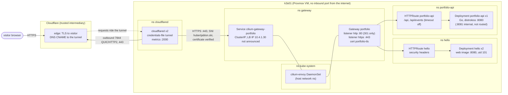
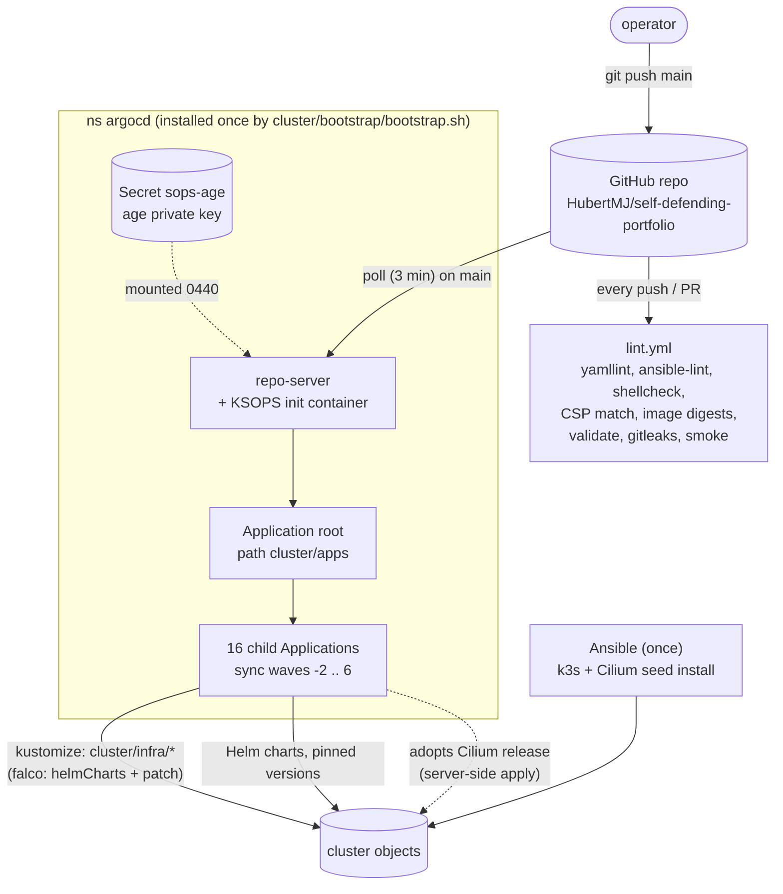
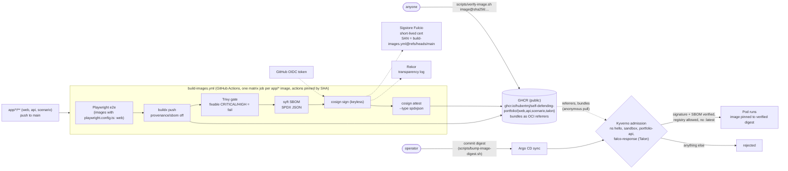
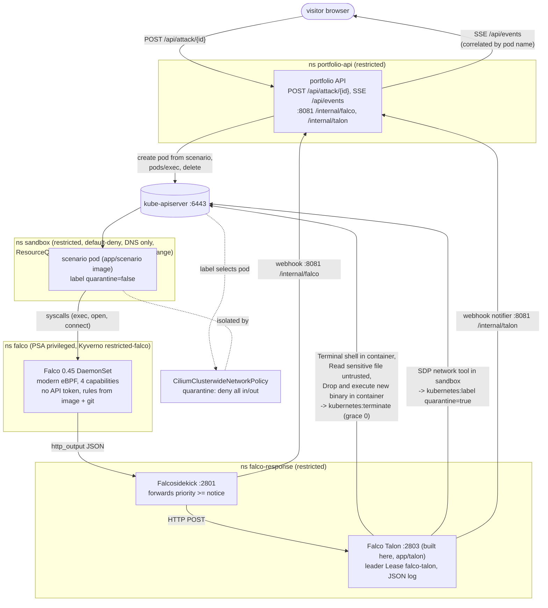
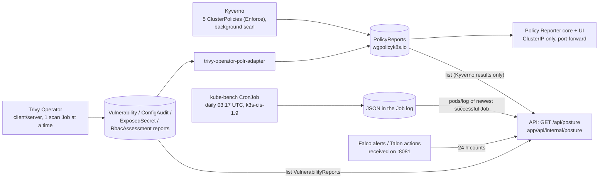

# Architecture

How the pieces of this repository fit together, drawn from the manifests rather than from intent.
Every box below names the namespace, port or file it comes from, so a diagram that drifts from the
code can be caught by reading the file it points at.

Everything drawn is in the repository (phases 1-6, including the visitor-facing API, the attack
scenarios and the site). Line legend used in every diagram:

- solid line: the main path of a request, a write or an action;
- dotted line: a side relationship (a mount, a credential or certificate, a lookup by the admission
  controller, a label selecting a policy, the reverse direction of the tunnel).

The overview below is a hand-drawn SVG (it follows the GitHub light/dark theme of your browser). The
four sections after it are Mermaid diagrams of one flow each.

Contents:

1. [Network path: visitor to page](#1-network-path-visitor-to-page)
2. [GitOps flow: commit to running object](#2-gitops-flow-commit-to-running-object)
3. [Supply chain: source to admitted pod](#3-supply-chain-source-to-admitted-pod)
4. [Detection and response loop](#4-detection-and-response-loop)
5. [Posture reporting](#5-posture-reporting)
6. [Namespaces at a glance](#6-namespaces-at-a-glance)

---

## 1. Network path: visitor to page

What the diagram claims, and where it is written down:

| Claim | Source |
|-------|--------|
| No port is opened on the router or on the host; the tunnel is dialled outbound | [ADR 0003](../adr/0003-cloudflare-tunnel-exposure.md), [`nftables.conf.j2`](../../ansible/roles/firewall/templates/nftables.conf.j2) (input policy drop) |
| Hostname routing lives in git, not in the Cloudflare dashboard (credentials-file mode); unknown hostnames get 404 | [`cluster/infra/cloudflared/config.yaml`](../../cluster/infra/cloudflared/config.yaml) |
| cloudflared may only talk to DNS, Cloudflare (`world` on 7844/443), the Gateway (443) and route backends on 8080 | [`cluster/infra/cloudflared/ciliumnetworkpolicy.yaml`](../../cluster/infra/cloudflared/ciliumnetworkpolicy.yaml) |
| The origin hop is HTTPS with verification (`originServerName`, `noTLSVerify: false`) | [`cluster/infra/cloudflared/config.yaml`](../../cluster/infra/cloudflared/config.yaml), [ADR 0010](../adr/0010-cilium-gateway-api.md) |
| Certificate: cert-manager, Let's Encrypt, DNS-01 against Cloudflare with a zone-scoped token | [`cluster/infra/cert-manager-issuers/`](../../cluster/infra/cert-manager-issuers/), [`cluster/apps/cert-manager.yaml`](../../cluster/apps/cert-manager.yaml) |
| Only namespaces labelled `portfolio.hubertjablon.ski/gateway-routes: "true"` may attach routes | [`cluster/infra/gateway/gateway.yaml`](../../cluster/infra/gateway/gateway.yaml) |
| HTTP is redirected to HTTPS twice: the `:80` listener, and `X-Forwarded-Proto: http` on `:443` | [`httproute-https-redirect.yaml`](../../cluster/infra/gateway/httproute-https-redirect.yaml), [`cluster/infra/hello/httproute.yaml`](../../cluster/infra/hello/httproute.yaml) |
| HSTS, CSP, nosniff, Referrer-Policy, Permissions-Policy, COOP are set at the Gateway | [`cluster/infra/hello/httproute.yaml`](../../cluster/infra/hello/httproute.yaml) |
| The route's CSP is exactly the web image's (same-origin scripts/styles/`connect-src`, Trusted Types enforced); CI fails if the two strings differ | [`app/web/security-headers.conf`](../../app/web/security-headers.conf), [`scripts/check-web-csp.sh`](../../scripts/check-web-csp.sh), [ADR 0019](../adr/0019-frontend-stack-and-csp.md) |
| `/api` wins over hello's `/` (longer prefix), repeats the HTTP-to-HTTPS redirect and sets its own headers, CSP `default-src 'none'` | [`cluster/infra/portfolio-api/httproute.yaml`](../../cluster/infra/portfolio-api/httproute.yaml), [ADR 0015](../adr/0015-portfolio-api.md) |
| Envoy trusts exactly one `X-Forwarded-For` hop (cloudflared) | [`cluster/apps/cilium.yaml`](../../cluster/apps/cilium.yaml) (`xffNumTrustedHops: 1`) |
| `hello` is default-deny, ingress only from Cilium's `ingress`/`host` identities on 8080, no egress at all | [`cluster/infra/hello/`](../../cluster/infra/hello/) |
| `portfolio-api` is default-deny; ingress 8080 from `ingress`/`host`, 8081 only from Falcosidekick and Talon; egress only kube-apiserver:6443 and DNS for `*.cluster.local` | [`cluster/infra/portfolio-api/ciliumnetworkpolicy.yaml`](../../cluster/infra/portfolio-api/ciliumnetworkpolicy.yaml), [`networkpolicy.yaml`](../../cluster/infra/portfolio-api/networkpolicy.yaml) |
| One Service, two audiences: `http` 80->8080 is the route's backend, `internal` 8081 is never routed | [`cluster/infra/portfolio-api/service.yaml`](../../cluster/infra/portfolio-api/service.yaml) |
| The Gateway's LoadBalancer address 10.4.1.30 exists only so the Gateway reports `Programmed`; nothing announces it | [`cluster/infra/gateway/lb-ip-pool.yaml`](../../cluster/infra/gateway/lb-ip-pool.yaml), [ADR 0010](../adr/0010-cilium-gateway-api.md) amendment |

Argo CD, Hubble and Policy Reporter are never routed through the Gateway or the tunnel; they are
reached with `kubectl port-forward` by someone who already holds cluster credentials.

The `portfolio-api` namespace carries the `gateway-routes` label
([`namespace.yaml`](../../cluster/infra/portfolio-api/namespace.yaml)), which both lets its route attach
and is what cloudflared's "route backends on 8080" egress rule selects on. The frontend
([`app/web/`](../../app/web/), TypeScript + esbuild, two-stage Dockerfile on nginx-unprivileged) calls
`/api` and opens the event stream same-origin, so the CSP needs nothing beyond `'self'`.

## 2. GitOps flow: commit to running object

- The **only** manual step after the host exists is [`cluster/bootstrap/bootstrap.sh`](../../cluster/bootstrap/bootstrap.sh):
  it creates the `argocd` namespace, the `sops-age` Secret from the operator's key file, and applies
  [`cluster/bootstrap/argocd/`](../../cluster/bootstrap/argocd/) (Argo CD v3.5.3 + KSOPS patch + the
  `root` Application). Its own README explains each choice: [`cluster/bootstrap/README.md`](../../cluster/bootstrap/README.md).
- `root` points at [`cluster/apps/`](../../cluster/apps/), one file per component. Wave order and the
  list of Applications are in [`cluster/apps/kustomization.yaml`](../../cluster/apps/kustomization.yaml):
  `gateway-api-crds` (-2), `cilium` (-1), `cert-manager` (0), `cert-manager-issuers` and `kyverno` (1),
  `kyverno-policies` and `cloudflared` (2), `gateway` (3), `hello` (4), in wave 5 `policy-reporter`,
  `trivy-operator`, `kube-bench`, `falco`, `falco-response`, `sandbox`, and `portfolio-api` (6), which
  has two sources: [`cluster/infra/portfolio-api/`](../../cluster/infra/portfolio-api/) and the scenario
  catalogue [`cluster/infra/sandbox/scenarios/`](../../cluster/infra/sandbox/scenarios/) (ConfigMap
  `scenarios`).
- Falco is one kustomize source, [`cluster/infra/falco/`](../../cluster/infra/falco/kustomization.yaml):
  the chart via `helmCharts` plus a post-render patch that makes every host mount read-only
  ([ADR 0013](../adr/0013-runtime-detection-and-response.md) amendment; needs `--enable-helm` in
  [`argocd-cm.yaml`](../../cluster/bootstrap/argocd/argocd-cm.yaml)). The other charts, Falcosidekick
  included, are Helm sources of their Applications.
- Secrets are committed SOPS-encrypted (only `data`/`stringData`, see [`.sops.yaml`](../../.sops.yaml)) and decrypted
  inside the repo-server by KSOPS ([ADR 0006](../adr/0006-sops-age-for-secrets.md)). Two exist: the
  Cloudflare DNS-01 token and the tunnel credentials. CI refuses any plaintext `kind: Secret` under
  `cluster/` ([`scripts/check-secrets-encrypted.sh`](../../scripts/check-secrets-encrypted.sh)).
- Every Application uses `project: default` and auto-sync with self-heal. Prune is off for `cilium`,
  `kyverno` and `gateway-api-crds`, where an accidental prune would remove the CNI, the admission
  webhook's backend or every Gateway ([ADR 0005](../adr/0005-argocd-for-gitops.md)).
- Documented exception: `root-application.yaml` and `argocd-cm.yaml` belong to the bootstrap layer and
  reach the cluster only through a manual `kubectl apply -k` (ADR 0005, amendment 2026-10-01).
- What CI checks before Argo CD sees a commit: [`.github/workflows/lint.yml`](../../.github/workflows/lint.yml) runs
  [`scripts/validate-cluster.sh`](../../scripts/validate-cluster.sh) (kustomize build + kubeconform against
  Kubernetes 1.35 and CRD schemas, Falco's `helmCharts` render with a read-only hostPath assertion,
  then `helm template` of every chart Application via
  [`scripts/render-charts.sh`](../../scripts/render-charts.sh) and `kyverno apply` of the repository's
  policies over all of it), [`scripts/check-web-csp.sh`](../../scripts/check-web-csp.sh),
  [`scripts/check-image-digests.sh`](../../scripts/check-image-digests.sh) (no all-zero placeholder
  digest on main), plus gitleaks over the full history and an idempotency smoke test of the
  hardening playbook ([`tests/smoke.sh`](../../tests/smoke.sh)).

## 3. Supply chain: source to admitted pod

| Step | File |
|------|------|
| Build (e2e gate for web), scan, SBOM, sign, attest, every `app/<name>/Dockerfile` | [`.github/workflows/build-images.yml`](../../.github/workflows/build-images.yml) |
| Why keyless, why a bundle, why fixable-only | [ADR 0011](../adr/0011-supply-chain.md) (and its 2026-10-01 amendment) |
| Why one matrix workflow and not a reusable one (the identity must be one file on main) | [ADR 0016](../adr/0016-one-image-workflow.md) |
| Admission: signature + SBOM by identity, `type: SigstoreBundle`, `mutateDigest`, `failurePolicy: Fail`; identity regex `build-images.yml` (and, until hello's digest is rebuilt, `build-web.yml`) `@refs/heads/main` | [`verify-portfolio-images.yaml`](../../cluster/infra/kyverno-policies/verify-portfolio-images.yaml) |
| Admission: only `ghcr.io/hubertmj/self-defending-portfolio/*` in `hello`, `sandbox` and `portfolio-api`, and in `falco-response` except the upstream Falcosidekick image (ADR 0023) | [`restrict-image-registries.yaml`](../../cluster/infra/kyverno-policies/restrict-image-registries.yaml) |
| Admission: no image without a tag or with `:latest` (cluster-wide minus system namespaces) | [`disallow-latest-tag.yaml`](../../cluster/infra/kyverno-policies/disallow-latest-tag.yaml) |
| The same verdict without a cluster | [`scripts/verify-image.sh`](../../scripts/verify-image.sh) |
| The negative test (unsigned, foreign, `:latest` all rejected) | [`tests/admission/run.sh`](../../tests/admission/run.sh) |
| No all-zero placeholder digest reaches main | [`scripts/check-image-digests.sh`](../../scripts/check-image-digests.sh) |

The deployed digest is bumped by a human commit; nothing auto-promotes a build (ADR 0011, known gap).
Third-party images (Cilium, Kyverno, Falco, ...) are pinned by tag and digest
([ADR 0008](../adr/0008-pinned-versions.md)) but are not signature-verified at admission: only this
project's own registry path is.
All five Kyverno policies run with `failureAction: Enforce`.

## 4. Detection and response loop

| Link | Enforced by |
|------|-------------|
| Falco: modern eBPF in least-privileged mode, `drop: [ALL]` + BPF, PERFMON, SYS_RESOURCE, SYS_PTRACE; no falcoctl, no k8smeta; custom rule "SDP network tool in sandbox"; every host mount read-only (post-render patch) | [`cluster/infra/falco/kustomization.yaml`](../../cluster/infra/falco/kustomization.yaml), [`cluster/apps/falco.yaml`](../../cluster/apps/falco.yaml), [ADR 0013](../adr/0013-runtime-detection-and-response.md) |
| Falco may only reach DNS and Falcosidekick:2801 | [`cluster/infra/falco/ciliumnetworkpolicy.yaml`](../../cluster/infra/falco/ciliumnetworkpolicy.yaml) |
| Falcosidekick accepts only Falco pods, sends to Talon:2803 and the API:8081; Talon accepts only Falcosidekick, egress only the API server, DNS for exactly `portfolio-api.portfolio-api.svc.cluster.local` and the API:8081 | [`cluster/infra/falco-response/ciliumnetworkpolicy.yaml`](../../cluster/infra/falco-response/ciliumnetworkpolicy.yaml) |
| The API's :8081 accepts only Falcosidekick and Talon (the webhooks are unauthenticated; this policy is their authentication) | [`cluster/infra/portfolio-api/ciliumnetworkpolicy.yaml`](../../cluster/infra/portfolio-api/ciliumnetworkpolicy.yaml) |
| Falcosidekick's webhook output to `/internal/falco` | [`cluster/apps/falco-response.yaml`](../../cluster/apps/falco-response.yaml) |
| Talon's only notifier is the webhook to `/internal/talon`; no Kubernetes Events (k8sevents off in 0.3.0); JSON log | [`cluster/infra/falco-response/talon/config.yaml`](../../cluster/infra/falco-response/talon/config.yaml), ADR 0013 correction |
| Response rules, all four matching `k8s.ns.name=sandbox` | [`cluster/infra/falco-response/talon/rules.yaml`](../../cluster/infra/falco-response/talon/rules.yaml) |
| Talon may get/patch/delete pods in `sandbox` only, plus its own Lease in `falco-response`; no events, nothing cluster-scoped | [`cluster/infra/sandbox/talon-rbac.yaml`](../../cluster/infra/sandbox/talon-rbac.yaml), [`cluster/infra/falco-response/talon-rbac.yaml`](../../cluster/infra/falco-response/talon-rbac.yaml) |
| Quarantine = a label plus a standing deny policy (deny beats allow) | [`cluster/infra/sandbox/quarantine-ccnp.yaml`](../../cluster/infra/sandbox/quarantine-ccnp.yaml) |
| Scenario catalogue: `shell-in-container`, `sensitive-file-read`, `drop-and-execute` -> terminate; `network-tool` -> quarantine | [`cluster/infra/sandbox/scenarios/scenarios.yaml`](../../cluster/infra/sandbox/scenarios/scenarios.yaml), [ADR 0017](../adr/0017-attack-scenario-safety-model.md), [ADR 0018](../adr/0018-scenario-detection-and-response-mapping.md) |
| The scenario target image: harmless triggers, no payload | [`app/scenario/Dockerfile`](../../app/scenario/Dockerfile) |
| What a visitor can make `sandbox` spend: 3 pods, 500m CPU, 512Mi, no Services/PVCs; per-container defaults and caps | [`resourcequota.yaml`](../../cluster/infra/sandbox/resourcequota.yaml), [`limitrange.yaml`](../../cluster/infra/sandbox/limitrange.yaml) |
| The API may create/get/list/delete pods and create pods/exec in `sandbox`, list pods and get pods/log in `kube-bench`, list three report kinds cluster-wide; nothing else | [`cluster/infra/portfolio-api/rbac.yaml`](../../cluster/infra/portfolio-api/rbac.yaml), [ADR 0015](../adr/0015-portfolio-api.md) |
| One replica, `Recreate`: run limits, replay buffer and run <-> alert correlation are in-process state | [`cluster/infra/portfolio-api/deployment.yaml`](../../cluster/infra/portfolio-api/deployment.yaml), [`app/api/`](../../app/api/) |
| End-to-end proof: shell -> alert -> kill, `wget` -> quarantine, RBAC can-i | [`tests/runtime/run.sh`](../../tests/runtime/run.sh) (`make runtime-test`) |
| Every scenario produces its alert, its action and the end state | [`tests/scenarios/run.sh`](../../tests/scenarios/run.sh) (`make scenario-test`), [`tests/scenarios/offline.sh`](../../tests/scenarios/offline.sh) |

## 5. Posture reporting

Sources: [ADR 0012](../adr/0012-pod-security-and-resource-policy.md),
[ADR 0014](../adr/0014-posture-scanning.md), [`cluster/apps/trivy-operator.yaml`](../../cluster/apps/trivy-operator.yaml),
[`cluster/apps/policy-reporter.yaml`](../../cluster/apps/policy-reporter.yaml),
[`cluster/infra/kube-bench/cronjob.yaml`](../../cluster/infra/kube-bench/cronjob.yaml),
[`app/api/internal/posture/posture.go`](../../app/api/internal/posture/posture.go) (what is read, and how
it is summarised), [`cluster/infra/portfolio-api/rbac.yaml`](../../cluster/infra/portfolio-api/rbac.yaml)
(the read grants).

## 6. Namespaces at a glance

| Namespace | PSA enforce | Network policy | Holds | Defined in |
|-----------|-------------|----------------|-------|------------|
| `kube-system` | none (cluster default) | none from this repo | Cilium agent/operator/envoy, Hubble relay, k3s add-ons | Ansible ([`ansible/roles/cilium/`](../../ansible/roles/cilium/)), [`cluster/apps/cilium.yaml`](../../cluster/apps/cilium.yaml) |
| `argocd` | restricted | none | Argo CD (no requests/limits: recorded debt) | [`cluster/bootstrap/argocd/`](../../cluster/bootstrap/argocd/) |
| `cert-manager` | restricted | none | cert-manager, issuers' DNS token | [`cluster/apps/cert-manager.yaml`](../../cluster/apps/cert-manager.yaml) |
| `kyverno` | restricted | none (egress open, see threat model) | admission, background, cleanup, reports controllers | [`cluster/apps/kyverno.yaml`](../../cluster/apps/kyverno.yaml) |
| `cloudflared` | restricted | CNP, explicit egress | tunnel x2 | [`cluster/infra/cloudflared/`](../../cluster/infra/cloudflared/) |
| `gateway` | restricted | n/a (no pods) | Gateway, redirect route, TLS Secret | [`cluster/infra/gateway/`](../../cluster/infra/gateway/) |
| `hello` | restricted | default-deny + CNP | the site | [`cluster/infra/hello/`](../../cluster/infra/hello/) |
| `policy-reporter` | restricted | default-deny + CNPs | reports UI | [`cluster/infra/policy-reporter/`](../../cluster/infra/policy-reporter/) |
| `trivy-system` | restricted | default-deny + CNPs (FQDN allow-list) | Trivy operator, server, scan Jobs, adapter | [`cluster/infra/trivy-operator/`](../../cluster/infra/trivy-operator/) |
| `kube-bench` | privileged (audit restricted) | default-deny, nothing opened | daily CIS CronJob | [`cluster/infra/kube-bench/`](../../cluster/infra/kube-bench/) |
| `falco` | privileged (audit restricted) | default-deny + CNP | Falco DaemonSet only | [`cluster/infra/falco/`](../../cluster/infra/falco/) |
| `falco-response` | restricted | default-deny + CNPs | Falcosidekick, Talon | [`cluster/infra/falco-response/`](../../cluster/infra/falco-response/) |
| `sandbox` | restricted | default-deny + DNS only + quarantine CCNP | short-lived victims / scenario pods (ResourceQuota + LimitRange) | [`cluster/infra/sandbox/`](../../cluster/infra/sandbox/) |
| `portfolio-api` | restricted | default-deny + CNP | the API, scenario catalogue ConfigMap | [`cluster/infra/portfolio-api/`](../../cluster/infra/portfolio-api/), [`cluster/infra/sandbox/scenarios/`](../../cluster/infra/sandbox/scenarios/) |

Host level (outside Kubernetes): Debian 13 VM `k3s01` on Proxmox, hardened by the roles in
[`ansible/roles/`](../../ansible/roles/) (SSH key-only from two admin VLANs, nftables input
default-deny, sysctl, auditd, unattended upgrades) and running k3s with secrets encryption, an audit
policy and no flannel/kube-proxy ([`ansible/roles/k3s/templates/config.yaml.j2`](../../ansible/roles/k3s/templates/config.yaml.j2)).
